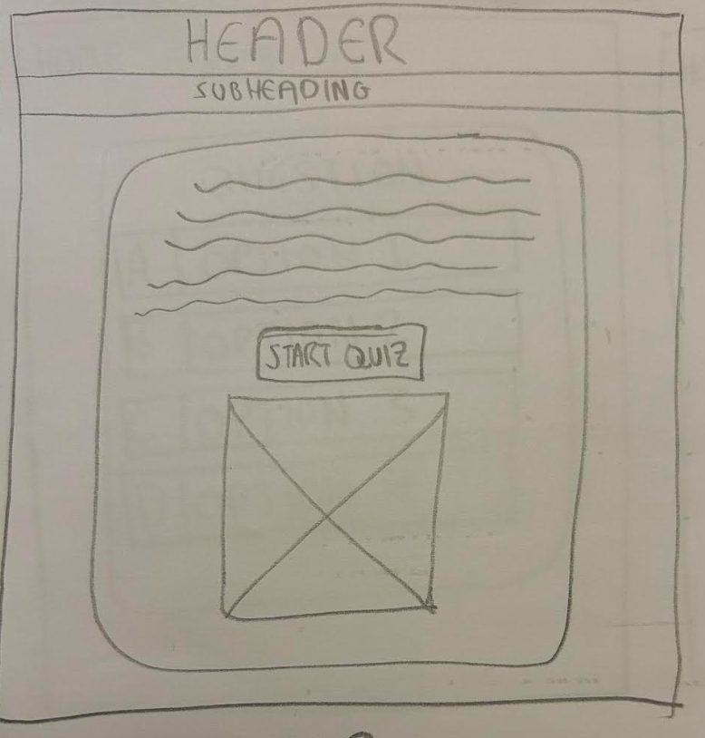

# Kendrick Lamar Competition

## An interactive quiz to enter a competition for a chance to win VIP tickets to a Kendrick Lamar concert

[View Website Link](https://zacpearce.github.io/MSP2-Quiz/)

# Business Goal

- ### Get as many people to enter the competition as possible to create a buzz about Kendrick Lamar's tour.

I aim to do this by offering a chance to win tickets to the concert and letting them enter the contest as many times as they'd like, the more times they complete it the more entries they get with more opportunities to win!

# UX (User Experience)

The user will clearly see what the intent of the page is as soon as you see the webpage, I tried to make the page as simple as possible so there's no confusion.  

## User stories
### First Time User
- to see what they can win
- to explain how they can win 
- to see an easy to find link to the quiz

### Returning and/or Frequent User
- They can have unlimited entries into the competition to increase their chances of winning 

# Design

For the design I used I tried to keep the theme of the DAMN. album and used colours that are attributed to the cover art, using a dark red, a bright red and white colours throughout the site.

# Typography

### *Times Roman*
 I used Times Roman as I feel it's easy to read and it also stays with the theme of Kendrick Lamar's album 'DAMN.' 

# Structure

## Header

- In the header I've called for the attention of all Kendrick Lamar fans, I tried to make it stand out by putting it in capital letters in a bright red font

## Home Page

- In the subheading you're alerted to the fact you have a chance to win VIP tickets to a Kendrick Lamar concert as soon as you open the page, I put it in capital letters with a bright red background to make it stand out

- Underneath the subheading I've explained what you need to do to win the tickets with further information about the tickets such as the time and location of the show. 

- I've put a the start to the quiz on a button saying "let's start the DAMN. quiz" as a play on words because of Kendrick Lamar's most acclaimed album 'DAMN.' and thats's what the quiz questions are based off.

## Winner

- If you get all 10 qustions correct it will take you to a winner's page where it will congraulate you on making it this far and give you further instructions on your next steps

- I have created a form that asks for your name and email address so we can put their information in the competition draw where the winner will be chosen at a later date.

### Loser
- If you get any questions wrong, at the end of the quiz it will take you to the loser page where there is a link to the home page and also a link to restart the quiz.

## Quiz

- I have created a multiple choice quiz of 10 Kendrick Lamar related questions, the question is a the top of the container and the answers are next to a prefix labelled either A, B, C or D.

- Once you select your answer it automatically shows you the next question.

# Wireframes

### Index

### Quiz

### Winner 

### Loser  

# Testing

To validate my HTML and CSS code I tested it via [W3C Markup Validation Service](https://validator.w3.org/)  and [W3C CSS Validation Service](https://jigsaw.w3.org/css-validator/)  I also used [Page Speed Insights](https://pagespeed.web.dev/) for further testing.

### W3C Markup Validation Results

Index Results

Quiz Results

Winner Results

Loser Results

### W3C CSS Validation Results

Index Results

Quiz Results

Winner Results

Loser Results
 

### Page Speed Results

Index

Quiz  

Winner 

Loser

# Technologies

- HTML - Used to create structure of the website
- CSS - Used to style the webpages to look more appealing for the user
- Gitpod - IDE to develop the website
- Javascript - Used to make webpage interactive
- Balsamiq - Used for wireframes

# Media

I only have one image and it's a picture of a poster I bought previously, the photo was taken by myself.

# Deployment

1. Log into GitHub.  
2. Select '**MSP2-Quiz**' from the repositories.  
3. Select '**Settings**' on the sub-headings. 
4. Select '**Pages**' on the left hand side under the '**Code and Automation**' section.  
5. Under the '**Build and Deployment**' section, click on the dropdown menu and select '**Main**'.  
6. Next to the '**/(root)**' button select '**save**'
7. An automated message will appear saying that Deployment is ready.  
8. Refresh the page and a link should appear at the top of the page.
9. Click on the link to go to the live deployed page.

# Credits

I would like to give special thanks to my mentor *Mitko Bachvarov* for his help on this project and my tutor Ebad Majeed for his help and patience.